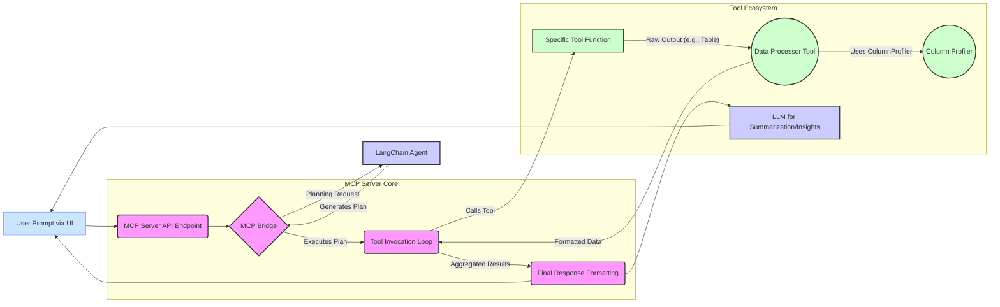

# MCP Server: Detailed Data Flow Documentation

*(Last Updated: May 2025)*

## 1. Introduction

This document provides a comprehensive technical overview of the data flow within the Model Context Protocol (MCP) Server. It details the journey of a user's prompt from its inception in the UI to the final processed output, highlighting key components, code interactions, and data transformations. Special attention is paid to how the `ColumnProfiler` and data processing tools are integrated to ensure dynamic, schema-aware handling of tabular data.

## 2. High-Level Overview

The following diagram illustrates the primary stages of data processing:



## 3. Step-by-Step Detailed Data Flow

### Step 1: User Prompt & UI Interaction

*   **File:** `ui/app.py`
*   **Function:** `@cl.on_message`
*   **Process:**
    1.  The user types a message (prompt) into the Chainlit UI.
    2.  The `@cl.on_message` Chainlit event handler captures this `cl.Message` object.
    3.  The UI constructs a JSON payload containing the user's message and session information.
    4.  This payload is sent via an HTTP POST request to the MCP server's primary chat endpoint (typically `/mcp` or `/stream` if streaming is used directly from UI to a specific streaming endpoint on the server).
*   **Data Structure (Input to UI):** `cl.Message` object.
*   **Data Structure (Output from UI to Server):**
    ```json
    // Example payload for /mcp endpoint
    {
      "message": "Show me top 5 USA clients and analyze their revenue trends",
      "session_id": "chat_1625304000"
    }
    ```
*   **Code Snippet (`ui/app.py`):**
    ```python
    @cl.on_message
    async def on_message(message: cl.Message):
        # ... (session management, history update) ...
        message_history = cl.user_session.get("message_history", [])
        message_history.append({"role": "user", "content": message.content})

        # ... (tool preparation for LLM call if UI calls LLM directly) ...
        # OR: direct call to MCP server endpoint if UI acts as a thin client
        
        # Assuming UI calls an MCP server endpoint that then handles LLM/tool logic:
        async with httpx.AsyncClient() as client:
            response = await client.post(
                f"{config.MCP_SERVER_URL}/mcp", # Example endpoint
                json={"message": message.content, "session_id": session_id}
            )
            # ... process server response ...
    ```
    *(Note: The `ui/app.py` provided shows a more complex flow where it directly calls an LLM with tools. For this data flow focused on server-side chaining, we assume the UI sends the prompt to an MCP server endpoint like `/mcp` which then orchestrates the LangChain planning and tool execution.)*

### Step 2: MCP Server - Request Ingestion

*   **File:** `app/streamlined_mcp_server.py` (or `app/main.py` if that's the primary entry point for FastAPI)
*   **Function:** FastAPI endpoint (e.g., `@app.post("/mcp")`) which calls `process_message()`.
*   **Process:**
    1.  The FastAPI server receives the HTTP request.
    2.  The request body is parsed and validated against a Pydantic model (e.g., `ChatRequest`).
    3.  The core `process_message(message: str, context: Dict[str, Any])` function is invoked.
*   **Data Structure (Input to Server):** JSON payload (as above).
*   **Data Structure (Internal):** `ChatRequest` Pydantic model.
    ```python
    # app/streamlined_mcp_server.py
    class ChatRequest(BaseModel):
        message: str = Field(..., description="The message to process")
        session_id: Optional[str] = Field(None, description="Optional session identifier")
    ```
*   **Code Snippet (`app/streamlined_mcp_server.py`):**
    ```python
    @app.post("/mcp", response_model=ChatResponse, tags=["Chat"])
    async def handle_mcp_request(request: ChatRequest):
        # ...
        context = {"session_id": request.session_id} if request.session_id else {}
        result_dict = await process_message(request.message, context)
        return result_dict
    ```

### Step 3: MCP Bridge - Routing & Planning (LangChain Integration)

*   **File:** `app/langchain_bridge.py` (primarily), `app/streamlined_mcp_server.py` (calls the bridge)
*   **Function:** `LangChainBridge.route_request()` which calls `LangChainBridge.plan_tool_chain()`.
*   **Process:**
    1.  `process_message()` in `streamlined_mcp_server.py` calls `bridge.route_request(message, context)`.
    2.  `LangChainBridge.route_request()` attempts to generate a plan using `plan_tool_chain()`.
    3.  `plan_tool_chain()`:
        *   Calls `_build_tools()`: MCP tools (discovered at startup from `app/tools/`) are wrapped into LangChain-compatible `Tool` objects. Their schemas (extracted via `_get_tool_schema` which uses `ColumnProfiler` logic for function signature introspection if needed) are used.
        *   Constructs a prompt for the LangChain agent, including the user query and available tools.
        *   Invokes the LangChain agent (e.g., an OpenAI Functions agent) via `agent_executor.ainvoke()`.
        *   The LLM (via LangChain) returns a sequence of desired tool calls (the "plan").
        *   `_validate_plan()` performs basic sanity checks on the plan.
    4.  If planning fails or returns no plan, it may fall back to `MCPBridge` (superclass) for Compass routing or direct LLM interaction.
    5.  The `route_request` function returns a dictionary containing the `intent` and a list of `endpoints` (the planned tool calls).
*   **Data Structure (Input to Bridge):** `query: str`, `context: Dict`
*   **Data Structure (Plan - Output from `plan_tool_chain`):** `List[Dict[str, Any]]`
    ```json
    // Example Plan
    [
      {
        "tool": "crm:get_top_clients", // Tool name, potentially namespaced
        "parameters": {"region": "USA", "limit": 5},
        "result": "<placeholder_or_actual_if_already_run_by_agent_internally>" // Depending on agent type
      },
      {
        "tool": "analytics:analyze_trend",
        "parameters": {"value_column": "Revenue", "group_column": "Client"}
      }
    ]
    ```
*   **Data Structure (Output from `route_request`):** `Dict[str, Any]`
    ```json
    // Example Routing Result
    {
      "intent": "tool_chain", // or specific tool name if single step
      "endpoints": [
        {"type": "tool", "name": "crm:get_top_clients", "params": {"region": "USA", "limit": 5}},
        {"type": "tool", "name": "analytics:analyze_trend", "params": {"value_column": "Revenue", "group_column": "Client"}}
      ],
      "confidence": 0.9,
      "prompt_type": "general",
      "plan": "[...full plan as above...]" // Optional: includes the raw plan
    }
    ```
*   **Code Snippet (`app/langchain_bridge.py` - `plan_tool_chain`):**
    ```python
    async def plan_tool_chain(self, query: str, context: Optional[Dict[str, Any]] = None) -> List[Dict[str, Any]]:
        tools = await self._build_tools()
        # ... (prompt setup) ...
        agent_executor = AgentExecutor(agent=agent, tools=tools, verbose=True)
        result = await agent_executor.ainvoke({"input": input_with_context})
        # ... (parse result into plan) ...
        return self._validate_plan(plan)
    ```

### Step 4: MCP Server - Tool Invocation Loop

*   **File:** `app/streamlined_mcp_server.py`
*   **Function:** Inside `process_message()`
*   **Process:**
    1.  The `process_message` function iterates through the `endpoints` list received from `bridge.route_request()`.
    2.  For each endpoint of `type: "tool"`, it retrieves the tool function from the `FastMCP` instance (`mcp.get_tools()`).
    3.  It creates a `FastMCP.Context` object.
    4.  The tool function is called with the extracted parameters and the context.
    5.  Results from each tool are collected.
*   **Data Structure (Input to Loop):** `routing_result["endpoints"]` (list of tool call definitions).
*   **Data Structure (Internal):** `tool_name: str`, `params: Dict`, `ctx: FastMCP.Context`.
*   **Code Snippet (`app/streamlined_mcp_server.py` - `process_message`):**
    ```python
    async def process_message(message: str, context: Dict[str, Any] = None) -> Dict[str, Any]:
        # ...
        routing_result = await bridge.route_request(message, context or {})
        # ... (handle no endpoints) ...

        results = []
        tools_executed = []
        for endpoint in routing_result["endpoints"]:
            if endpoint["type"] == "tool":
                tool_name = endpoint["name"]
                params = endpoint.get("params", {})
                tools_executed.append(tool_name)
                
                mcp_tools_dict = await mcp.get_tools() # mcp is FastMCP instance
                if tool_name in mcp_tools_dict:
                    ctx = Context(context or {})
                    tool_func = mcp_tools_dict[tool_name].fn
                    try:
                        # Try calling with parameters only (context is injected by decorator)
                        if params: result = await tool_func(**params)
                        else: result = await tool_func()
                    except TypeError: # If TypeError, try calling with ctx as first parameter
                        if params: result = await tool_func(ctx, **params)
                        else: result = await tool_func(ctx)
                    results.append(result)
                # ... (else tool not found) ...
        # ... (format final response) ...
    ```

### Step 5: Tool Execution

*   **Files:** Specific tool files in `app/tools/` (e.g., `app/tools/clientview_financials.py`, `app/tools/analytics_suite.py`, `app/tools/data_processor.py`).
*   **Function:** The actual decorated tool function (e.g., `get_top_clients`, `visualize_data`, `format_table_for_llm`).
*   **Process:**
    1.  The tool function executes its specific logic (e.g., calling an external API, performing calculations, generating a chart).
    2.  It returns its result. For tools producing tabular data, this is typically a `List[Dict[str, Any]]`. For visualization tools, it might be a base64 encoded image string or a path to a saved file.
*   **Data Structure (Input to Tool):** `ctx: Context`, `**params` (specific to the tool's schema).
*   **Data Structure (Output from Tool):** Varies.
    *   Tables: `List[Dict[str, Any]]` or `pd.DataFrame` (which `_ensure_dataframe_and_profile` handles).
    *   Charts/Text: `str` (Markdown, base64 image string, file path).
    *   Structured Output: `Dict[str, Any]` often with an `"output"` key.
*   **Code Snippet (Example from `app/tools/analytics_suite.py` - `summarize_table`):**
    ```python
    @mcp.tool()
    async def summarize_table(
        ctx: Context,
        data: Union[List[Dict[str, Any]], pd.DataFrame],
        columns: Optional[List[str]] = None
    ) -> str:
        profiler = ColumnProfiler() # Instantiated within tool or globally
        df, metadata_map = _ensure_dataframe_and_profile(data, profiler)
        if df is None or metadata_map is None: return "No data..."
        # ... uses metadata_map to generate summary ...
        return "\n".join(summary_parts)
    ```

### Step 6: Data Processing & Profiling (Integration Point)

This is a critical step, especially when a tool (like a financial data endpoint) returns raw tabular data that needs to be understood and formatted before being passed to another tool or to the LLM.

*   **Triggering:**
    1.  **Explicitly by LangChain Plan:** The LangChain agent might decide that the output of `Tool A` needs to be processed by `format_table_for_llm` before being fed to `Tool B`. In this case, `format_table_for_llm` is just another tool in the `endpoints` list.
    2.  **Implicitly by Tool Design:** An analytical tool (e.g., `visualize_data` from `analytics_suite.py`) might internally call `_ensure_dataframe_and_profile()` on its input data. This function, in turn, uses `ColumnProfiler`.
    3.  **As a final formatting step:** The main `process_message` loop might decide to pass the aggregated raw table through `format_table_for_llm` before sending it to the UI or LLM.
*   **File:** `app/tools/data_processor.py` (for `format_table_for_llm`, `clean_and_prepare_table`) and `app/utils/column_profiler.py` (for `ColumnProfiler`).
*   **Function:** `format_table_for_llm()` or `clean_and_prepare_table()`.
*   **Process within `format_table_for_llm`:**
    1.  Input data (`List[Dict[str, Any]]` or `pd.DataFrame`) is converted to a `pd.DataFrame`.
    2.  `ColumnProfiler.profile_dataframe(df)` is called. This iterates through each column:
        *   `_clean_column_name()`: Standardizes names (e.g., `ytd_rev_usd` -> `Revenue YTD`) and extracts units.
        *   `_infer_semantic_type_and_units()`: Determines semantic type (Currency, Percentage, Date, ID, etc.) using heuristics and regex based on column name and data content.
        *   `_get_basic_stats()`: Calculates count, nulls, unique, min/max, mean, etc.
        *   `_generate_description()`: Creates a textual summary of the column.
        *   `_suggest_formatting_rules()`: Suggests how to format values (e.g., `currency:USD:,.2f`).
        *   Returns a `Dict[str, ColumnMetadata]`.
    3.  The `format_table_for_llm` tool then uses this `metadata_map` to:
        *   `filter_rows()`: Apply limits, sorting based on actual data types inferred.
        *   `select_columns()`: Choose relevant columns.
        *   `detect_anomalies()`: Use semantic types to guide checks.
        *   `add_summary_row()`: Aggregate based on semantic type (sum for currency, mean for percentage).
        *   `add_ranking_indicators()`: For numeric columns.
        *   `format_cell_values()`: Apply formatting suggestions from metadata (e.g., `$1,234.56`, `15.2%`).
        *   Rename columns to their `cleaned_name` and add `units` for the final display DataFrame.
        *   `generate_column_descriptions_from_metadata()`: Create preamble for Markdown.
        *   Format the processed DataFrame into Markdown, JSON, or bullet points.
*   **Data Structure (Input to `format_table_for_llm`):** `data: List[Dict[str, Any]]` (raw table).
*   **Data Structure (Internal - `ColumnProfiler` output):** `Dict[str, ColumnMetadata]`
    ```python
    # app/utils/column_profiler.py
    class ColumnMetadata(BaseModel):
        original_name: str
        cleaned_name: str
        semantic_type: str # e.g., "Currency", "Percentage", "Date"
        pandas_dtype: str
        units: Optional[str] # e.g., "USD", "%"
        description: str
        formatting_suggestion: Optional[str] # e.g., "currency:USD:,.2f"
        # ... other stats ...
    ```
*   **Data Structure (Output from `format_table_for_llm`):** `str` (formatted Markdown, JSON, or bullets).
*   **Code Snippet (`app/tools/data_processor.py` - `format_table_for_llm`):**
    ```python
    async def format_table_for_llm(ctx: Context, data: List[Dict[str, Any]], ...) -> str:
        df_original = _ensure_dataframe(data)
        metadata_map = profiler.profile_dataframe(df_original) # Profiler is instantiated in register_tools

        # ... (calls to filter_rows, select_columns using metadata_map) ...
        df_processed = filter_rows(df_original, metadata_map, limit, sort_by, ascending)
        # ...
        
        # This uses metadata_map to apply specific formatting
        df_formatted_cells = format_cell_values(df_processed, metadata_map) 
        
        # This renames columns based on metadata_map[col].cleaned_name
        df_final_display = pd.DataFrame() 
        # ... logic to build df_final_display with cleaned names and units ...

        if output_format.lower() == "markdown":
            return format_as_markdown(df_final_display, metadata_map, ...)
        # ... other formats ...
    ```

### Step 7: Response Aggregation & Final Output Generation

*   **File:** `app/streamlined_mcp_server.py` (within `process_message()`).
*   **Process:**
    1.  The `results` list (containing outputs from each tool, potentially processed by `data_processor.py`) is consolidated.
    2.  If multiple tools were run, their outputs might be concatenated or passed to a final summarization step.
    3.  If the LangChain plan included a final call to an LLM tool like `generate_insights` (from `analytics_suite.py`), this tool would receive the processed data/markdown from previous steps and generate a natural language summary.
    4.  The final response text, list of executed tools, intent, and processing time are packaged.
*   **Data Structure (Input):** `results: List[Any]` (mixed list of strings, dicts).
*   **Data Structure (Output - `ChatResponse`):**
    ```python
    # app/streamlined_mcp_server.py
    class ChatResponse(BaseModel):
        response: str
        tools_executed: List[str]
        intent: Optional[str]
        processing_time_ms: Optional[float]
    ```
*   **Code Snippet (`app/streamlined_mcp_server.py` - `process_message`):**
    ```python
        # ... (after tool execution loop) ...
        if results:
            # ... (logic to combine/format multiple results into response_text) ...
            response_text = "\n\n".join(str(r) for r in results) # Simplified example
        else:
            response_text = "I couldn't find any tools to execute for your request."
        
        return {
            "response": response_text,
            "tools_executed": tools_executed,
            "intent": routing_result.get("intent"),
            "processing_time_ms": (time.time() - start_time) * 1000
        }
    ```

### Step 8: Output to UI / LLM

*   **UI (Chainlit):**
    *   **File:** `ui/app.py`
    *   **Function:** Logic within `@cl.on_message` that handles the server's response.
    *   **Process:**
        1.  The UI receives the `ChatResponse` JSON from the MCP server.
        2.  It displays the `response` content. If the response contains Markdown tables or base64 encoded images (from `visualize_data` via `data_processor`), Chainlit renders them appropriately.
        3.  Tool execution steps (if streamed or sent back as part of a more complex UI protocol) are displayed individually. The current `ui/app.py` calls an LLM and then handles tool calls sequentially, displaying each tool's output.
    *   **Data Structure (Input to UI):** JSON `ChatResponse`.
    *   **Data Structure (Rendered):** HTML, Markdown, Images.
    *   **Code Snippet (`ui/app.py` - handling tool calls if UI makes them):**
        ```python
        # Inside @cl.on_message, after LLM returns tool_calls
        for tool_call in tool_calls:
            # ...
            with cl.Step(name=f"Executing tool: {tool_name}", type="tool"):
                tool_result = await execute_tool(tool_name, tool_args) # Calls MCP server /execute

            formatted_result = format_tool_result(tool_result) # format_tool_result uses format_table_output
            await cl.Message(content=f"Tool Result from {tool_name}:\n{formatted_result}", author="Tool").send()
        ```
*   **LLM (Final Summarization - if applicable):**
    *   If the last step in a chain is a call to `generate_insights` or a similar LLM-powered tool, the processed and formatted data (e.g., Markdown report from `format_table_for_llm`) is passed as context to the LLM.
    *   **File:** `app/client.py` (if `mcp_client.call_llm` is used by the `generate_insights` tool), `app/tools/analytics_suite.py` (for `generate_insights` tool logic).
    *   **Data Structure (Input to LLM):** Prompt string containing formatted data and the user's original query or a summarization task.
    *   **Data Structure (Output from LLM):** Natural language text.

## 4. Key Data Structures Summary

*   **`ColumnMetadata` (`app/utils/column_profiler.py`):** Central Pydantic model holding all profiled information about a DataFrame column. Used extensively by `data_processor.py` and `analytics_suite.py`.
*   **Plan (`List[Dict[str, Any]]` in `app/langchain_bridge.py`):** Ordered list of tool calls generated by LangChain.
*   **Routing Result (`Dict[str, Any]` in `app/langchain_bridge.py`):** Contains the plan and intent.
*   **Tool Inputs/Outputs:** Vary, but tabular data is typically `List[Dict[str, Any]]` or `pd.DataFrame`.
*   **`ChatRequest` / `ChatResponse` (`app/streamlined_mcp_server.py`):** Pydantic models for API communication.

## 5. Role of ColumnProfiler and Data Processor

*   **`ColumnProfiler` (`app/utils/column_profiler.py`):**
    *   **Function:** Analyzes a raw `pd.DataFrame` column by column.
    *   **Output:** For each column, produces a `ColumnMetadata` object detailing its original name, cleaned name, semantic type (Currency, Date, ID, etc.), units, statistics (min, max, mean, nulls, unique values), and formatting suggestions.
    *   **Integration:** Used by `format_table_for_llm` and `clean_and_prepare_table` in `app/tools/data_processor.py` to understand the structure and content of any input table dynamically. Also used by tools in `app/tools/analytics_suite.py` to make intelligent decisions about how to process and visualize data.

*   **Data Processor Tools (`app/tools/data_processor.py` - e.g., `format_table_for_llm`):**
    *   **Function:** Takes raw tabular data (often `List[Dict]` from an endpoint) and uses the `ColumnProfiler`'s output (`metadata_map`) to perform a series of intelligent transformations:
        1.  **Normalization:** Cleans column names (e.g., `ytd_rev_usd` -> `Revenue YTD`).
        2.  **Unit Handling:** Appends units to column names (e.g., `Revenue YTD (USD)`).
        3.  **Numerical Formatting:** Applies appropriate formatting (e.g., `$1,234.56`, `15.2%`) based on semantic type and `formatting_suggestion` from `ColumnMetadata`.
        4.  **Filtering/Sorting/Selection:** Uses inferred data types for correct operations.
        5.  **Annotation & Summarization:** Can add summary rows or anomaly notes based on profiled data.
        6.  **Output Formatting:** Converts the processed DataFrame into Markdown (with column descriptions derived from `ColumnMetadata.profile_summary`), JSON (with embedded `column_profiles`), or bullet points, ready for an LLM or UI.
    *   **Integration:** Can be explicitly called as a tool in a LangChain plan or used internally by other tools that need to present tabular data. Crucially, it makes subsequent tools and the LLM "smarter" by providing them with well-understood and well-formatted data.

## 6. Conclusion

This detailed data flow demonstrates a robust and flexible system for processing user prompts. The integration of LangChain for planning, FastMCP for tool execution, and the dynamic `ColumnProfiler` with `data_processor` tools allows the MCP Server to handle complex queries, chain multiple operations, and present data in a clear, context-aware, and LLM-friendly manner. This architecture is designed for scalability and adaptability to new tools and data sources.
