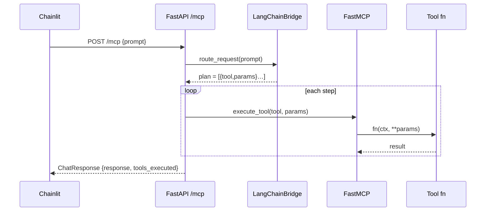

# LangChain Tool Chaining in the MCP Server  
*(Last updated May 2025)*  

## 1  Why LangChain?  
FastMCP already gives us a registry and an execution engine, but it does **not** decide **which** tool(s) to run or **how** to chain them for a complex question.  
`LangChainBridge` adds that missing reasoning layer:

```
┌─User Prompt
│
│ 1.  Intent & schema aware reasoning  (LangChain Agent)
│ 2.  Creates an ordered PLAN  =  [ {tool→params}, … ]
│ 3.  MCP executes each step, pipes outputs, returns final LLM answer
└────────────────────────────────────────────────────────────────────
```

---

## 2  Tool Discovery & Validation  

| Stage | Responsibility |
|-------|----------------|
| **Autodiscovery** | `streamlined_mcp_server.autodiscover_tools()` imports every `app/tools/*.py`, runs `register_tools(mcp)` or picks up `@mcp.tool()` decorators. |
| **Schema extraction** | For every tool, the bridge looks in order: `input_schema ➜ schema ➜ parameters ➜ Python signature` to build an OpenAI-function JSON schema. |
| **Client-side validation** | Before a function call is accepted, LangChain ensures its arguments satisfy that schema (= *client validation*). |

---

## 3  Planning Algorithm (LangChainBridge)  

```
plan_tool_chain()
    ↓
 1  build_tools()       – wrap MCP tools as OpenAI functions
 2  compose Prompt      – System + user + tool list
 3  call LLM            – returns function-call messages
 4  _validate_plan()    – sanity-check steps & fill defaults
```

Each **plan step** looks like:

```json
{
  "tool": "crm:get_top_clients",
  "parameters": {"region": "USA", "limit": 5}
}
```

If the agent returns *zero* steps we fall back to Compass routing or raw LLM chat.

---

## 4  Stage-to-Stage Output Passing  

```
[get_top_clients]  → a list[dict] table
                    │
        format_table_for_llm (data processing tool)
                    │
         cleaned markdown / DataFrame
                    ▼
[analyze_trend]  → trend summary Markdown
                    │
            (plus inline base-64 chart)
                    ▼
LLM final answer  → conversational summary
```

1. **Financial endpoint** returns raw tabular JSON.  
2. **`format_table_for_llm`** normalises headers, formats numbers, truncates rows → LLM-ready markdown.  
3. Subsequent analytics tools (`compare_groups`, `analyze_trend`, …) accept DataFrame/markdown seamlessly.  
4. Final step may be `generate_insights` (LLM) that wraps everything into prose.

---

## 5  Execution Flow (HTTP mode)



Key excerpt (`app/streamlined_mcp_server.process_message`):

```python
routing = await bridge.route_request(message, context)

for ep in routing["endpoints"]:
    tool_fn = (await mcp.get_tools())[ep["name"]].fn
    try:
        result = await tool_fn(**ep["params"])
    except TypeError:
        result = await tool_fn(Context(context), **ep["params"])
    results.append(result)
```

---

## 6  Concrete Walk-Through  

### 6.1  “Show me the top 5 USA clients and tell me if their revenue is rising”

| Step | What happens | Data payload |
|------|--------------|--------------|
| **1** | `plan_tool_chain()` →<br>```[{"tool":"crm:get_top_clients","parameters":{"region":"USA","limit":5}}, {"tool":"analyze_trend","parameters":{"value_column":"Revenue","group_column":"Client"}}]``` | plan list |
| **2** | `crm:get_top_clients` → 5-row list\<dict\> from ClientView | raw table |
| **3** | `analyze_trend` converts list → DataFrame, detects trend, outputs markdown + chart | markdown |
| **4** | Server concatenates results → UI | final answer |

---

## 7  Chaining with Data Processor  

Typical pipeline for financial endpoints:

```
<endpoint tool> → format_table_for_llm → analytic tool(s) → generate_insights
```

`format_table_for_llm` cleans & annotates tables before analytics, raising LLM accuracy.

---

## 8  Adding New Tools  

1. Create `app/tools/forecasting.py`.  
2. Register with `@mcp.tool()` or `register_tools(mcp)`.  
3. Restart server – schema auto-exposed at `/tools`, agent can now chain it.

---

## 9  Error Handling & Fallbacks  

| Layer | Technique |
|-------|-----------|
| **Plan validation** | `_validate_plan()` drops steps with bad schema, logs warning |
| **Tool execution** | Each call wrapped in `try/except`; on error returns `"Error …"`; chain continues |
| **Bridge failure** | If planning raises, falls back to Compass routing or pure LLM answer |

---

## 10  Debugging Cheatsheet  

| Command | Insight |
|---------|---------|
| `curl :8080/tools` | Inspect live tool schemas |
| `mcp-tools execute visualize_data …` | Run tool in isolation |
| `uvx status` | MCP PIDs + health |
| `LOG_LEVEL=DEBUG` | Verbose plan + tool logs |

---

## 11  **Detailed Technical Flow & Memory Management**

### 11.1  End-to-End Diagram

```mermaid
flowchart TD
    subgraph Prompt Cycle
        U[User Prompt] -->|1| B[LangChain<br>Agent]
        B -->|2 plan| P[[PLAN<br>JSON]]
    end
    P -->|each step| E[Execution Loop]
    subgraph MCP Runtime
        E -->|ctx & params| T[Tool fn]
        T -->|raw/processed data| DP[format_table_for_llm<br>(optional)]
        DP -->|DataFrame / md| AN[Analytic Tool]
        AN -->|markdown/chart| RES[Partial Result]
    end
    RES -->|append| AGG[Aggregator]
    AGG -->|final markdown| LLM[generate_insights (LLM)]
    LLM -->|response| U

    subgraph Memory
        U -.->|stores| R[(Redis Short-Term)]
        T -.->|reads/writes| R
    end

    classDef store fill:#fdf6e3,stroke:#657b83,color:#586e75;
    R:::store
```

### 11.2  Context & Memory Handling

```python
# app/memory/short_term.py
class ShortTermMemory:
    def add_message(self, role: str, content: str):
        self.redis_client.rpush(self.session_key, json.dumps({"r": role, "c": content}))
```

* Every user/assistant/tool message is pushed to Redis (if available).  
* `Context(context_dict)` is re-created per tool call, so each tool sees:  
  ```python
  {
     "session_id": "...",
     "memory_tail": memory.last_n(10)
  }
  ```

### 11.3  Error Propagation Example

```python
# app/langchain_bridge.py
try:
    result = await self.execute_tool(tool_name, params)
except Exception as e:
    logger.error(f"Error executing {tool_name}: {e}")
    return f"Error executing {tool_name}: {e}"
```

*Error text* is returned as normal step output — later tools can still run.

### 11.4  Code Snippet: Building Tools

```python
# app/langchain_bridge.py excerpt
lc_tool = Tool(
    name=tool_name,
    func=tool_fn,
    coroutine=tool_fn,
    description=description,
    args_schema=schema   # ← JSON schema discovered earlier
)
```

The above object is fed into `llm.bind(functions=[…])`, enabling native
OpenAI-function calling with **strict argument checking**.

### 11.5  Data Conversion Highlights
* `ensure_dataframe()` converts list\<dict\> ↔ DataFrame reliably.  
* `figure_to_base64()` embeds charts directly into Markdown replies.  
* `detect_time_series_column()` auto-identifies the best date column for trend tools.

---

#### **Take-away**

LangChain + FastMCP delivers **schema-validated, memory-aware, multi-tool workflows** with robust error handling and automatic data cleaning. Drop a new tool into `app/tools/` and it’s instantly plannable, executable, and streamable — all orchestrated by a single user sentence.  
