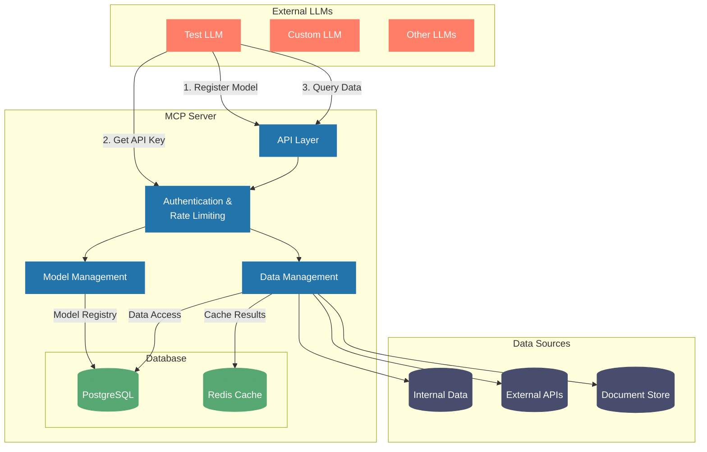
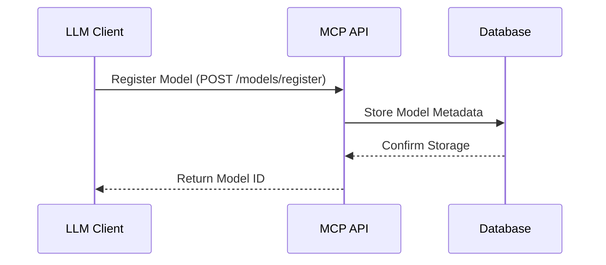
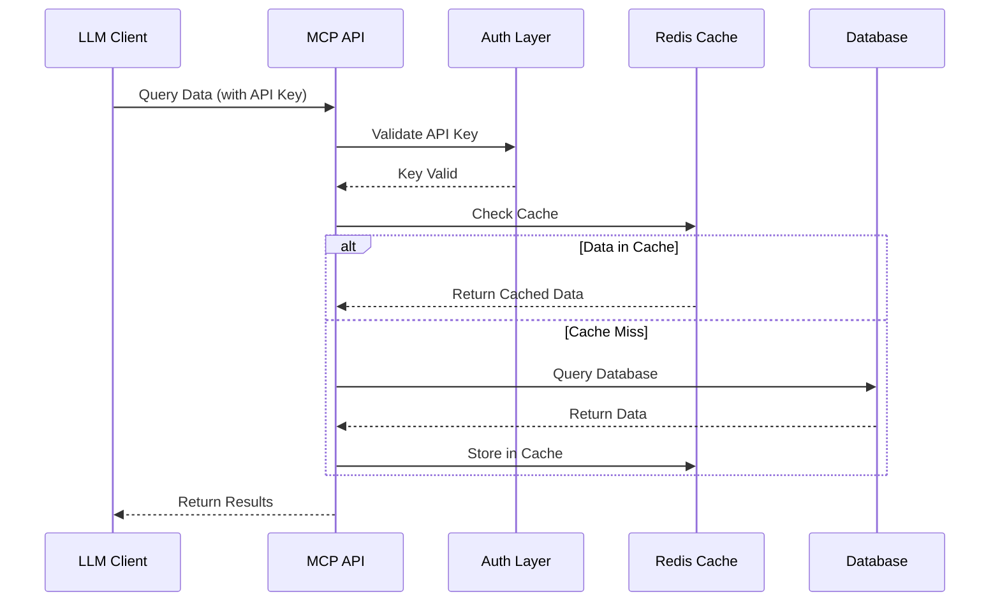

# Model Context Protocol (MCP)

MCP is a platform that enables secure access to enterprise data sources through custom ML models. It provides a standardized way to connect models with various data sources while maintaining security and monitoring usage.

## Core Features

- **Data Source Access**: Connect to enterprise databases, Azure Storage, and Snowflake
- **Access Control**: Fine-grained permissions for data access
- **Usage Monitoring**: Track and monitor model usage and data access
- **Security**: API key management and audit logging

## Project Structure

```
mcp/
├── app/                    # Core application code
│   ├── api/               # API endpoints
│   ├── core/              # Core functionality
│   ├── models/            # Database models
│   └── schemas/           # Pydantic schemas
├── tests/                 # Test files
├── .env                   # Environment variables
├── .env.example          # Example environment setup
├── conftest.py           # Test configuration
├── main.py               # Application entry point
├── requirements.txt      # Project dependencies
└── README.md            # Project documentation
```

## Setup

1. Create a virtual environment:
```bash
python -m venv venv
source venv/bin/activate  # On Windows: venv\Scripts\activate
```

2. Install dependencies:
```bash
pip install -r requirements.txt
```

3. Configure environment:
```bash
cp .env.example .env
# Edit .env with your settings
```

4. Run the application:
```bash
uvicorn main:app --reload
# python main.py
# python main.py --port 8001
# python main.py --host 127.0.0.1 --port 8000 --reload --debug --workers 4
```

## API Documentation

The API documentation is available at:
- Swagger UI: http://localhost:8000/docs
- ReDoc: http://localhost:8000/redoc

## Data Sources

MCP supports the following data sources:

1. **Internal Databases**
   - PostgreSQL databases
   - Job market data
   - Homebuilders data

2. **Cloud Storage**
   - Azure Blob Storage
   - Structured datasets
   - Historical records

3. **Data Warehouses**
   - Snowflake
   - Analytics-ready datasets
   - Market metrics

## Security

1. **API Keys**
   - Secure key generation
   - Permission-based access
   - Key rotation support

2. **Data Access**
   - Field-level permissions
   - Usage quotas
   - Audit logging

3. **Monitoring**
   - Usage tracking
   - Error logging
   - Access patterns

## Development

1. **Running Tests**:
```bash
pytest
```

2. **Code Style**:
```bash
flake8
black .
```

3. **Type Checking**:
```bash
mypy .
```

## Contributing

1. Fork the repository
2. Create a feature branch
3. Make your changes
4. Submit a pull request

## License

This project is licensed under the MIT License - see the LICENSE file for details.

Need help? Contact support@mcp.ai

## Architecture Overview



## System Components

### 1. External LLMs
- **Test LLM**: Lightweight test client for development
- **Custom LLMs**: User-developed models
- **Other LLMs**: Third-party integrations

### 2. MCP Server Components
- **API Layer**: FastAPI-based REST endpoints
- **Authentication**: API key management and validation
- **Rate Limiting**: Request throttling and quota management
- **Data Management**: Data access and caching
- **Model Management**: Model registration and lifecycle

### 3. Data Sources
- **Internal Data**: Direct database access
- **External APIs**: Third-party data services
- **Document Store**: Document and file storage

## Interaction Flow

1. **Model Registration**


2. **Data Access**


## Quick Start

```bash
# Start the MCP server
python main.py --port 8001

# In another terminal, run the test LLM client
cd test_client
python test_llm.py
```