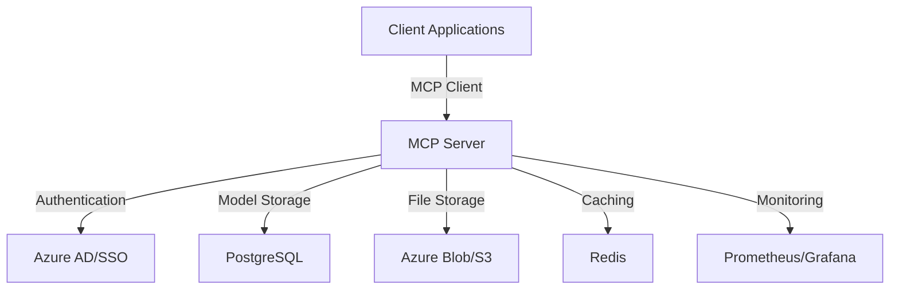

# Model Control Platform (MCP)

A centralized platform for managing, registering, and controlling AI models across your organization.

## 🗺️ Quick Navigation

| If you want to... | Go to... | Description |
|-------------------|----------|-------------|
| 📦 Install MCP Client | [Installation Guide](USAGE.md#installation) | Set up the client package |
| 🔑 Register a Model | [Model Registration](USAGE.md#using-pip-package-recommended) | Register models via CLI, SDK, or API |
| 🛠️ Configure Settings | [Configuration Reference](USAGE.md#configuration-reference) | Learn about all config options |
| 🔍 View Examples | [Examples](USAGE.md#examples) | See example implementations |
| 🐛 Troubleshoot | [Troubleshooting](USAGE.md#troubleshooting) | Common issues and solutions |

## 🏗️ Architecture Overview



## 💾 Data Storage

- **Default**: Local PostgreSQL database for development
- **Production**: 
  - Azure Database for PostgreSQL
  - Azure Blob Storage/S3 for model artifacts
  - Redis for caching and rate limiting

## 🔐 Security & Access

1. **Authentication**:
   - Azure AD integration
   - API key-based access
   - Role-based access control (RBAC)

2. **Data Access**:
   - Centralized access control
   - Audit logging
   - Encryption at rest and in transit

## 🌐 Centralized Management

The MCP server acts as a single source of truth for:
- Model registrations
- Access permissions
- Model metadata
- Usage statistics
- Resource allocation

## 📊 Storage Flow

1. **Model Registration**:
   ```
   Client -> MCP Server -> PostgreSQL (metadata)
                       -> S3/Blob (artifacts)
   ```

2. **Model Access**:
   ```
   Client -> MCP Server -> Redis (cache check)
                       -> PostgreSQL (if not cached)
                       -> S3/Blob (if artifacts needed)
   ```

## 🚀 Getting Started

1. **Install the client**:
   ```bash
   pip install mcp-client
   ```

2. **Configure your environment**:
   ```bash
   export MCP_SERVER_URL="https://mcp.yourorg.com"
   export MCP_API_KEY="your-api-key"
   ```

3. **Register your first model**:
   ```bash
   mcp register model_config.yaml
   ```

## 📝 Configuration Examples

### Local Development
```yaml
storage:
  type: local
  database_url: postgresql://localhost:5432/mcp
  artifacts_path: ./storage/models
```

### Production
```yaml
storage:
  type: cloud
  database_url: ${AZURE_POSTGRES_URL}
  blob_storage:
    provider: azure
    container: model-artifacts
    connection_string: ${AZURE_STORAGE_CONNECTION_STRING}
```

## 🔄 Workflow

1. **Model Registration**:
   - Model metadata stored in PostgreSQL
   - Model artifacts stored in blob storage
   - Access permissions configured
   - Health check performed

2. **Model Access**:
   - Authentication verified
   - Permissions checked
   - Cache consulted
   - Access logged

3. **Monitoring**:
   - Usage metrics collected
   - Performance monitored
   - Alerts configured

## 📚 Additional Resources

- [Detailed Documentation](USAGE.md)
- [API Reference](docs/api.md)
- [Security Guide](docs/security.md)
- [Best Practices](docs/best-practices.md)

## 🤝 Support

For issues and support:
- Create an issue in the repository
- Contact MCP support team
- Join our Slack channel

## 🔜 Roadmap

- [ ] Multi-region support
- [ ] Model versioning
- [ ] A/B testing framework
- [ ] Automated scaling
- [ ] Model performance analytics 