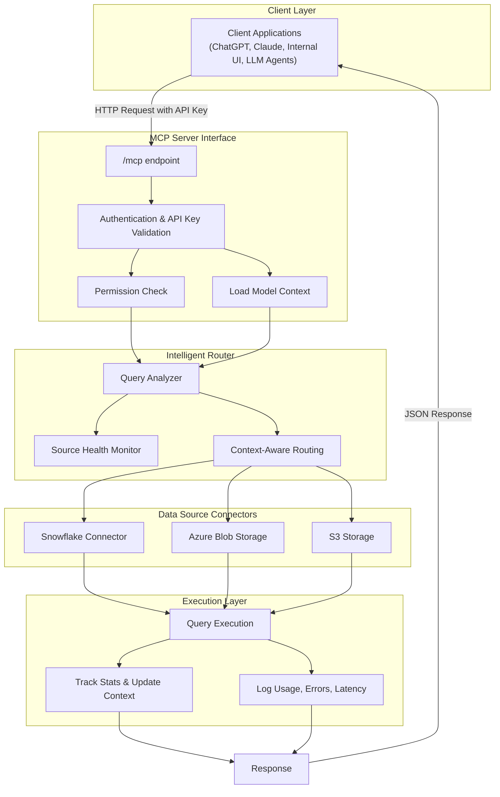
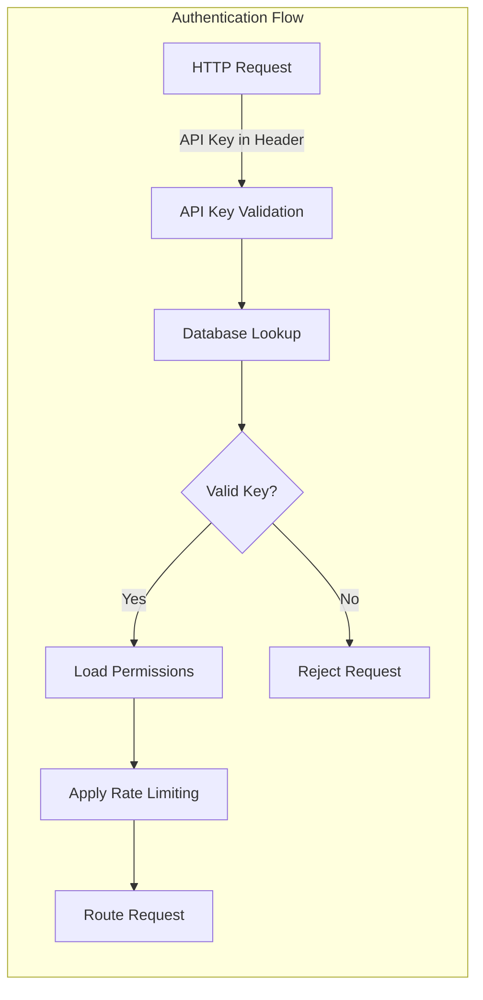
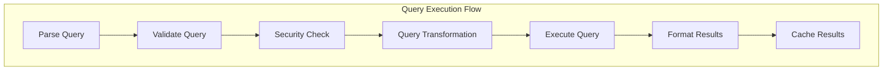
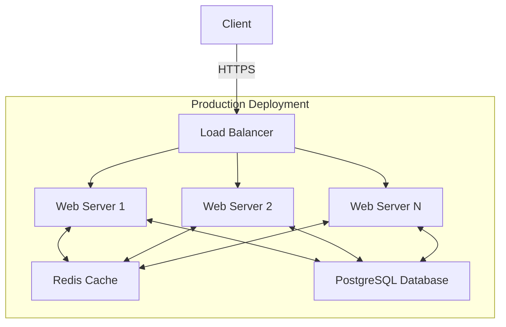

# Model Context Protocol (MCP) Architecture

## System Overview

The Model Context Protocol (MCP) server provides a unified interface between client applications and various data sources, enabling secure, context-aware interactions with models and data.



## Key Features

### Client-Agnostic Interface

The MCP server provides a universal interface that works with:

- **LLM Applications**: Claude, ChatGPT, Bard, etc.
- **Web UI**: Custom dashboards and interfaces
- **Plugins & Extensions**: Browser extensions, IDE plugins
- **CLI Tools**: Command-line utilities and scripts

All clients interact with the system through a single consistent interface, making integration simple and standardized.

### Authentication Layer



- **API Key Management**: Generate, revoke, and refresh API keys
- **Granular Permissions**: Control access at data source and operation levels
- **Rate Limiting**: Prevent abuse with configurable rate limits
- **Request Logging**: Track all authentication attempts for auditing

### Routing Layer

The intelligent router analyzes each request and determines the optimal path for execution:

- **Context-Aware Routing**: Routes requests based on data source health, past performance, and query complexity
- **Performance Scoring**: Tracks and scores data source performance for optimal routing
- **Load Balancing**: Distributes requests across replicated data sources
- **Fallback Mechanisms**: Handles failures gracefully with configured fallbacks

### Execution Layer



- **Secure Execution**: Sanitizes inputs and applies query restrictions
- **Performance Optimization**: Transforms queries for optimal execution
- **Result Caching**: Caches results for frequently requested data
- **Transaction Management**: Ensures data consistency across operations

### Monitoring & Observability

- **Health Checks**: Regular background health checks of all data sources
- **Performance Metrics**: Tracks latency, throughput, and error rates
- **Usage Statistics**: Records query patterns and resource utilization
- **Error Tracking**: Captures and categorizes failures for analysis

## Data Source Connectors

### Snowflake Integration

- **Query Execution**: Run SQL queries directly against Snowflake
- **Schema Discovery**: Explore databases, schemas, and tables
- **Data Export**: Export query results in various formats
- **Parameter Binding**: Securely pass parameters to queries

### Azure Blob Storage

- **Container Management**: List and navigate blob containers
- **Blob Operations**: Read, write, and delete blobs
- **Metadata Handling**: Manage blob metadata and properties
- **SAS Token Generation**: Create secure access signatures for direct access

### S3 Integration

- **Bucket Navigation**: Browse S3 buckets and objects
- **Object Operations**: Upload, download, and manipulate objects
- **Versioning Support**: Access previous versions of objects
- **Presigned URL Generation**: Create temporary access URLs

## Security Considerations

- **API Key Rotation**: Regular key rotation policies
- **Request Validation**: Strict validation of all incoming requests
- **Query Sanitization**: Prevention of injection attacks
- **Audit Logging**: Comprehensive logging of all operations
- **Data Access Controls**: Enforcement of data access boundaries

## Deployment Architecture



- **Horizontally Scalable**: Add more server instances as load increases
- **High Availability**: No single point of failure
- **Distributed Caching**: Shared cache for query results and authentication
- **Database Replication**: Primary/replica setup for database resilience

## Integration Options

### OpenAPI/Swagger Support

The MCP server provides comprehensive OpenAPI documentation:

- **Interactive Documentation**: Available at `/docs` endpoint
- **API Explorer**: Test endpoints directly from the documentation
- **Schema Definitions**: Complete request/response schemas
- **Example Queries**: Sample requests for common operations

### Python Client SDK

```python
# Example usage of the Python client SDK
from mcp_client import MCPClient

# Initialize the client
client = MCPClient(
    api_key="your_api_key",
    base_url="https://your-mcp-server.com/mcp"
)

# Query Snowflake
result = client.query_snowflake(
    source_name="analytics", 
    query="SELECT * FROM sales WHERE region = 'WEST'"
)

# List models
models = client.list_models()

# Generate with a model
response = client.generate_with_model(
    model_id="gpt4-turbo",
    prompt="Analyze this sales data and provide insights"
)
```

The Python SDK simplifies integration with:

- **Automatic Authentication**: Handles API key management
- **Response Parsing**: Converts JSON responses to Python objects
- **Error Handling**: Robust exception handling with detailed error information
- **Retry Logic**: Automatic retries with exponential backoff
- **Async Support**: Asynchronous client for high-performance applications

### OAuth2 Integration

For advanced authentication needs, the MCP server supports OAuth2:

- **Multiple Identity Providers**: Support for various OAuth providers
- **Role-Based Access Control**: User roles with granular permissions
- **Token Management**: Automatic token refresh and validation
- **Scoped Access**: Limit access to specific resources and operations 