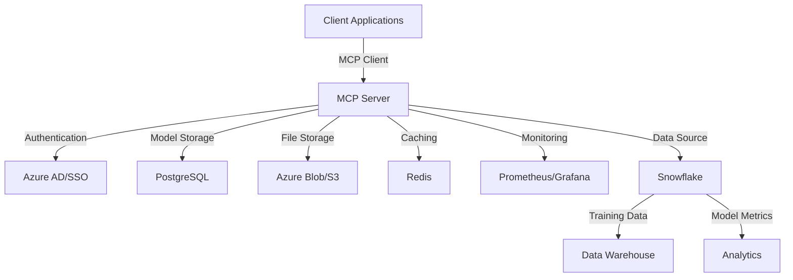

# Model Context Protocol (MCP)

A comprehensive platform for managing, monitoring, and optimizing model interactions with data sources.

## Features

### Core Infrastructure
- FastAPI-based server with comprehensive error handling
- Rate limiting and request throttling
- API key authentication system
- Logging and monitoring
- Configurable storage backends

### Model Management
- Model registration and configuration
- Model status tracking and health checks
- Version control and deployment management
- Model performance monitoring

### Query Processing
- ML-based natural language to SQL conversion
- Query optimization suggestions
- Query caching with Redis
- Performance analytics and monitoring
- Support for multiple database backends

### Advanced Query Features
- Semantic query understanding using ML models
- Pattern matching with example-based learning
- Query optimization suggestions
- Automated query testing
- Query performance tracking

### Monitoring & Analytics
- Real-time query performance monitoring
- Prometheus metrics integration
- Multi-channel alerting (Email, Slack, PagerDuty)
- Customizable alert thresholds
- Performance analytics dashboard

### Caching & Optimization
- Redis-based query cache
- Intelligent cache invalidation
- Query optimization suggestions
- Performance analytics
- Cache hit/miss monitoring

### Security
- API key management
- Permission-based access control
- Secure credential storage
- Request validation
- Rate limiting

### Storage Backends
- Snowflake integration
- PostgreSQL support
- Azure Data Lake integration
- Extensible storage interface
- Automatic schema management

## Setup

1. Install dependencies:
```bash
pip install -r requirements.txt
```

2. Configure environment variables:
```bash
cp .env.example .env
# Edit .env with your configuration
```

3. Initialize the database:
```bash
python scripts/init_db.py
```

4. Start the server:
```bash
uvicorn app.main:app --reload
```

## Configuration

### Query Cache
```yaml
cache:
  backend: redis
  host: localhost
  port: 6379
  ttl: 300  # 5 minutes
```

### Monitoring
```yaml
monitoring:
  alert_channels:
    - email
    - slack
    - pagerduty
  thresholds:
    slow_query: 5.0  # seconds
    error_rate: 0.1  # 10%
    cache_miss_rate: 0.4  # 40%
    concurrent_queries: 100
```

### Storage
```yaml
storage:
  type: snowflake  # or postgres, azure
  snowflake:
    account: your_account
    warehouse: your_warehouse
    database: your_database
    schema: your_schema
```

## Usage

### Query Example
```python
from mcp.client import MCPClient

client = MCPClient(api_key="your_api_key")

# Natural language query
result = await client.query("Show me active jobs for today")

# Direct SQL query
result = await client.execute_sql("SELECT * FROM jobs WHERE status = 'active'")
```

### Monitoring Example
```python
from mcp.monitoring import MonitoringSystem

monitor = MonitoringSystem(config)
await monitor.start_monitoring()
```

### Cache Example
```python
from mcp.cache import QueryCache

cache = QueryCache(config)
result = await cache.get(query, params)
if not result:
    result = execute_query(query, params)
    await cache.set(query, params, result)
```

## Contributing

1. Fork the repository
2. Create a feature branch
3. Commit your changes
4. Push to the branch
5. Create a Pull Request

## License

MIT License - see LICENSE file for details

## 🗺️ Quick Navigation

| If you want to... | Go to... | Description |
|-------------------|----------|-------------|
| 📦 Install MCP Client | [Installation Guide](usage.md#installation) | Set up the client package |
| 🔑 Register a Model | [Model Registration](usage.md#using-pip-package-recommended) | Register models via CLI, SDK, or API |
| 🛠️ Configure Settings | [Configuration Reference](usage.md#configuration-reference) | Learn about all config options |
| ❄️ Connect to Snowflake | [Snowflake Integration](snowflake.md) | Set up Snowflake data source |
| 🔍 View Examples | [Examples](usage.md#examples) | See example implementations |
| 🐛 Troubleshoot | [Troubleshooting](usage.md#troubleshooting) | Common issues and solutions |

## 🏗️ Architecture Overview



## 💾 Data Storage & Integration

- **Default**: Local PostgreSQL database for development
- **Production**: 
  - Azure Database for PostgreSQL
  - Azure Blob Storage/S3 for model artifacts
  - Redis for caching and rate limiting
- **Data Warehouse**:
  - Snowflake integration for:
    - Training data access
    - Model performance metrics
    - Feature store integration
    - Historical predictions

## 🔐 Security & Access

1. **Authentication**:
   - Azure AD integration
   - API key-based access
   - Role-based access control (RBAC)
   - Snowflake key pair authentication

2. **Data Access**:
   - Centralized access control
   - Audit logging
   - Encryption at rest and in transit
   - Snowflake secure views and row-level security

## 🌐 Centralized Management

The MCP server acts as a single source of truth for:
- Model registrations
- Access permissions
- Model metadata
- Usage statistics
- Resource allocation

## 📊 Storage Flow

1. **Model Registration**:
   ```
   Client -> MCP Server -> PostgreSQL (metadata)
                       -> S3/Blob (artifacts)
   ```

2. **Model Access**:
   ```
   Client -> MCP Server -> Redis (cache check)
                       -> PostgreSQL (if not cached)
                       -> S3/Blob (if artifacts needed)
   ```

## 🚀 Getting Started

1. **Install the client**:
   ```bash
   pip install mcp-client
   ```

2. **Configure your environment**:
   ```bash
   export MCP_SERVER_URL="https://mcp.yourorg.com"
   export MCP_API_KEY="your-api-key"
   ```

3. **Register your first model**:
   ```bash
   mcp register model_config.yaml
   ```

## 📝 Configuration Examples

### Local Development
```yaml
storage:
  type: local
  database_url: postgresql://localhost:5432/mcp
  artifacts_path: ./storage/models

snowflake:
  enabled: false  # Disabled for local development
```

### Production
```yaml
storage:
  type: cloud
  database_url: ${AZURE_POSTGRES_URL}
  blob_storage:
    provider: azure
    container: model-artifacts
    connection_string: ${AZURE_STORAGE_CONNECTION_STRING}

snowflake:
  enabled: true
  account: ${SNOWFLAKE_ACCOUNT}
  warehouse: ${SNOWFLAKE_WAREHOUSE}
  database: ${SNOWFLAKE_DATABASE}
  schema: ${SNOWFLAKE_SCHEMA}
  role: ${SNOWFLAKE_ROLE}
  user: ${SNOWFLAKE_USER}
  private_key_path: ${SNOWFLAKE_PRIVATE_KEY_PATH}
  query_timeout: 600
  connection_timeout: 30
```

### Snowflake Integration Example
```python
from mcp_client import MCPClient, SnowflakeConfig

# Configure Snowflake connection
snowflake_config = SnowflakeConfig(
    account="your_account",
    warehouse="COMPUTE_WH",
    database="ML_DATA",
    schema="PUBLIC",
    role="ML_ENGINEER"
)

# Initialize client with Snowflake support
client = MCPClient(
    base_url="https://mcp.yourorg.com",
    api_key="your-api-key",
    snowflake_config=snowflake_config
)

# Query training data from Snowflake
training_data = client.get_training_data(
    query="SELECT * FROM training_data WHERE model_version = 'v1'"
)
```

## 🔄 Workflow

1. **Model Registration**:
   - Model metadata stored in PostgreSQL
   - Model artifacts stored in blob storage
   - Access permissions configured
   - Health check performed
   - Training data location registered (Snowflake)

2. **Model Access**:
   - Authentication verified
   - Permissions checked
   - Cache consulted
   - Access logged
   - Data source connections validated

3. **Data Integration**:
   - Snowflake connection established
   - Query optimization applied
   - Data access permissions verified
   - Secure data transfer ensured

4. **Monitoring**:
   - Usage metrics collected
   - Performance monitored
   - Alerts configured
   - Snowflake query metrics tracked

## 📚 Additional Resources

- [Detailed Documentation](usage.md)
- [API Reference](api_keys.md)
- [Security Guide](security.md)
- [Best Practices](best-practices.md)

## 🤝 Support

For issues and support:
- Create an issue in the repository
- Contact MCP support team
- Join our Slack channel

## 🔜 Roadmap

- [ ] Multi-region support
- [ ] Model versioning
- [ ] A/B testing framework
- [ ] Automated scaling
- [ ] Model performance analytics
- [ ] Enhanced Snowflake integration features:
  - [ ] Automated feature store
  - [ ] Real-time prediction logging
  - [ ] Cross-database model validation
  - [ ] Distributed training support 